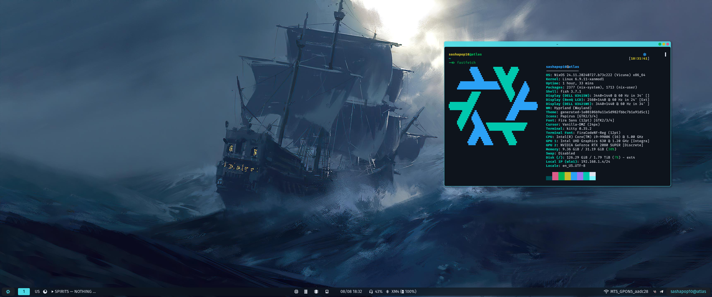

<h1 align="center">Deep dive into declarative configuration</h1>

<h5 align="center">
  <a href="https://github.com/sashapop10/nixos/issues">
    
  </a>
  <a href="https://github.com/sashapop10/nixos/stargazers">
    
  </a>
  <a href="https://github.com/sashapop10/nixos">
    
  </a>
  <a href="https://github.com/sashapop10/nixos/blob/main/.github/LICENCE">
    
  </a>
</h5>

<h5 align="center">

<details open="true">
  <summary><b>👉 Atlas</b> <i>"</i>State of 2024-08-09<i>"</i> 👈</summary><br/>



</details>

<details >
  <summary><b>👉 Hermes</b> <i>"</i>State of 2024-08-22<i>"</i> 👈</summary><br/>


</details>

</h5>

## Installation

> [!CAUTION]
>
> Applying custom configurations, especially those related to your operating system, can have unexpected consequences and may interfere with your system's normal behavior. While I have tested these configurations on my own setup, there is no guarantee that they will work flawlessly for you. I am not responsible for any issues that may arise from using this configuration.

```bash
# Automatic installation
# Working with Live CD
nix-shell -p curl git
./install.sh
```

```bash
# Manual installation
# Working with Live CD
nix-shell -p curl git
curl https://raw.githubusercontent.com/sashapop10/nixos/main/core/hosts/<hostname>/disko.nix > /mnt/config/disko.nix
# Edit disko.nix (Replace device with name from lsblk result at least)
sudo nix --experimental-features "nix-command flakes" run github:nix-community/disko -- --mode disko /mnt/config/disko.nix
git clone https://github.com/sashapop10/nixos /mnt/flake
sudo nixos-generate-config --dir /mnt/config
mv -f /mnt/config/hardware-configuration.nix /mnt/flake/core/hosts/<hostname>
sudo nixos-install --flake /mnt/flake#<hostname>
# reboot 🚀
```

## Updates

```bash
nix-channel --update
nix flake update
sudo nixos-rebuild --upgrade switch --flake .#<hostname>
```

## Rebuilding

```bash
git add . # Important if new files were created
sudo nixos-rebuild switch --flake .#<hostname> # If Hosts updated
home-manager switch --flake .#<username>@<hostname> # If ONLY Home updated
```

## Highlights

| Brief                                            | Description                                                                                                                                                                                      |
| ------------------------------------------------ | ------------------------------------------------------------------------------------------------------------------------------------------------------------------------------------------------ |
| Host-specific environment                        | Every module will receive extra argument: `{ myEnv, ... }:`. This variable contains environment variables pulled from **hosts/environment.nix,** and **hosts/${host}/environment.nix** if exists |
| User-specific configuration                      | Define your users with environment `users = [ "${userA-login}" "${userB-login}" ]` and add new user at **/core/users/${login}** if needed, configuration will do the rest.                       |
| Declarative&nbsp;themes&nbsp;and&nbsp;wallpapers | Automatic colorscheme generation based on configured wallpaper. Accessible with `config.wallpaper` and `config.colorscheme` at home-manager.                                                     |
| Automatic installation                           | Repository contains **install.sh** script which allows me to install this configuration with minimal effort.                                                                                     |
| State synchronization                            | Syncing some directories between multiple hosts with **syncthing**.                                                                                                                              |
| Extensively configured                           | Extensively configured wayland environment (**hyprland**) and editors (**nixvim** and **vscode**)                                                                                                |
| Flexible configuration                           | Extend **nixos** and **home-manager** configurations through **feature flags**. This policy allow me to make heavy and thin configurations.                                                      |
| Dualboot support                                 | Pre-configured grub and systemd for **dualboot** and **dualdrive** boot.                                                                                                                         |
| Standalone Home-manager                          | Update home-manager configuration with `nixos-rebuild` and separately with `home-manager switch`.                                                                                                |
| Privacy and Security                             | DNS Encryption with **dnscrypt-proxy** and DPI fooling with **bol-van/zapret**.                                                                                                                  |
| Lightweight ISO                                  | Bare-bones or most minimal and optimized **NixOS ISO**.                                                                                                                                          |
| Easy to manage                                   | Host specific configuration doesn't contain any unnecessary or repeated logic. Also i put a lot of effort to make it automatic as possible.                                                      |

## Structure

```graphql
.
│  # Core
│ ╭> global                         # Global NixOS configurations (auto-imported)
├─┼> users                          # Users configuration (auto-imported)
│ ├> options                        # Optional configurations (access via host/configuration.nix)
│ ╰> default.nix                    # Loader, imported by hosts/default.nix
│
│  # Home
│ ╭> global                         # Global Home-manager configurations (auto-imported)
├─┼> options                        # Optional configurations (access via host/home.nix)
│ ╰> default.nix                    # Loader, imported by hosts/default.nix
│
│  # Hosts
│ ╭> atlas                          # Desktop  32GB RAM, i9-9900k, RTX 2080S & UHD630 | Hyprland
│ ├> hermes                         # Laptop   16GB RAM, i7-1165G7, Iris XE G7 | Hyprland
│ ├> iso                            # Minimal ISO image configuration for bootable USB
│ ├> environment.nix                # Global environment
│ ├> default.nix                    # Loader
├─┤
│ │  # Host configuration
│ │ ╭> configuration.nix            # NixOS Configuration
│ │ ├> hardware-configuration.nix   # Hardware configuration    (optional, result of nixos-generate-config)
│ └─┼> environment.nix              # Host specific environment (optional, if no need of overriding the env)
│   ├> home.nix                     # Home-manager config       (optional, if home-manager is not in use)
│   ├> disko.nix                    # Disko configuration       (optional, only for standalone disko run)
│   ╰> host_ed25519.pub             # Ssh ed25519 public key    (optional, if not accessible via network)
│
│  # Library
│ ╭> overlays                       # Patches and custom overrides for some packages.
├─┼> modules                        # Modules for more accurate customization.
│ ├> utils                          # Utilities for Nix language.
│ ╰> pkgs                           # Self hosted packages
│
├> .github                          # Docs, assets, workflows
├> .vscode                          # Makes vscode more performant in this directory.
├> install.sh                       # Shell script for automatic installation.
├> shell.nix                        # Exposes a dev shell for bootstrapping.
╰> flake.nix                        # Entrypoint
```

<p align="center">
Copyright © 2023-2024 <a href="https://github.com/sashapop10">sashapop10</a>.<br/>
This package is <a href="./LICENSE">MIT licensed</a>.<br/>
</p>

<h5 align="center">

</h5>
