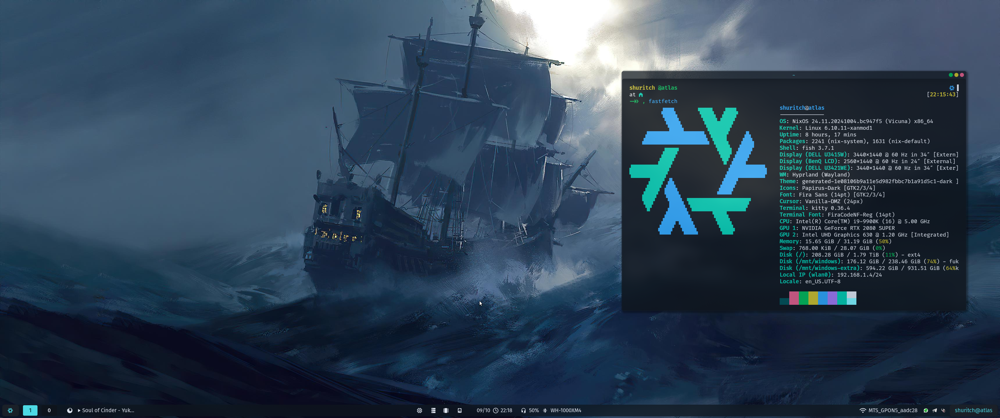

<h1 align="center">
Deep dive into declarative configuration
</h1>

<!-- <div align="center">
  <a href="https://github.com/shuritch/nixos/issues">
    
  </a>
  <a href="https://github.com/shuritch/nixos/stargazers">
    
  </a>
  <a href="https://github.com/shuritch/nixos">
    
  </a>
    <a href="https://github.com/shuritch/nixos/pulse">
    
  </a>
  <a href="https://github.com/shuritch/nixos/blob/main/.github/LICENCE">
    
  </a>
    <a href="https://github.com/shuritch/nixos/releases/latest">
    
  </a>
</div> -->

<div align="center">
<p>

**[<kbd><br>&nbsp;Installation&nbsp;<br><br></kbd>](#installation)**
**[<kbd><br>&nbsp;Structure&nbsp;<br><br></kbd>](#structure)**
**[<kbd><br>&nbsp;Flake&nbsp;<br><br></kbd>](../flake.nix)**
**[<kbd><br>&nbsp;Assets&nbsp;and&nbsp;Preview&nbsp;<br><br></kbd>](./assets/)**
**[<kbd><br>&nbsp;Cluster&nbsp;<br><br></kbd>](../cluster/)**
**[<kbd><br>&nbsp;Modules&nbsp;<br><br></kbd>](../src/modules/)**
**[<kbd><br>&nbsp;Workflows&nbsp;<br><br></kbd>](./workflows/)**

</p>
<p align="center">
<code>📦&nbsp;Userland&nbsp;Isolation</code>
<code>🍙&nbsp;Declarative</code>
<code>🌱&nbsp;Reproducible</code>
<code>👁️‍🗨️&nbsp;Private</code>
<code>🛡️&nbsp;Secure</code>
<code>🏗️&nbsp;Custom&nbsp;Installer</code>
<code>🧪&nbsp;CI</code>
<code>🎨&nbsp;Colorscheme&nbsp;based&nbsp;on&nbsp;wallpaper</code>
<code>🔧&nbsp;Extensively&nbsp;configured</code>
<code>🐧&nbsp;Minimal&nbsp;when&nbsp;needed</code>
<code>🧳&nbsp;Role&nbsp;based&nbsp;configuration</code>
<code>🚀&nbsp;Class&nbsp;based&nbsp;configuration</code>
<code>⚡&nbsp;Easy&nbsp;to&nbsp;manage</code>
<code>🖇️&nbsp;Dualboot&nbsp;support</code>
<code>🔃&nbsp;State&nbsp;synchronization</code>
<code>🗿&nbsp;User&nbsp;specific&nbsp;configuration</code>
</p>
</div>

## Installation

> [!CAUTION]
>
> Applying custom configurations, especially those related to your operating system, can have unexpected consequences and may interfere with your system's normal behavior. While I have tested these configurations on my own setup, there is no guarantee that they will work flawlessly for you. I am not responsible for any issues that may arise from using this configuration.

```bash
# Automatic installation (Live CD)
nix-shell -p curl git
./install.sh
```

```bash
# Manual installation (Live CD)
nix-shell -p curl git
curl https://raw.githubusercontent.com/shuritch/nixos/main/core/cluster/<hostname>/disko.nix > /mnt/config/disko.nix
# Edit disko.nix (Replace device with name from lsblk result at least)
sudo nix --experimental-features "nix-command flakes" run github:nix-community/disko -- --mode disko /mnt/config/disko.nix
git clone https://github.com/shuritch/nixos /mnt/etc/nixos/flake
sudo nixos-generate-config --dir /mnt/etc/nixos
mv -f /mnt/etc/nixos/hardware-configuration.nix /mnt/etx/nixos/flake/cluster/<hostname>
sudo nixos-install --flake /mnt/etc/nixos/flake#<hostname>
# reboot 🚀
```

## Updates

```bash
nix flake update
sudo nixos-rebuild --upgrade switch --flake .#<hostname>
```

## Rebuilding

```bash
git add . # Important if new files were created
sudo nixos-rebuild switch --flake .#<hostname> # If Hosts updated
```

## Structure

```graphql
.
│  # 👇 Cluster
│ ╭> atlas                          # Desktop │ 32GB RAM, i9-9900k , RTX 2080S & UHD630 │ Hyprland
│ ├> hermes                         # Laptop  │ 16GB RAM, i7-1165G7, Iris XE G7         │ Hyprland
│ ├> pandora                        # ISO     │ Bootable USB                            │ TTY
├─┤
│ │  # 👇 Host configuration (example)
│ │ ╭> config                       # Separated configuration
│ │ ├> hardware-configuration.nix   # Generated hardware configuration.
│ └─┼> default.nix                  # Configuration entry point.
│   ╰> host_ed25519.pub             # Ssh ed25519 public key.
│
│   ╭> home                         # Modules written to isolate Home-manager configuration.
│ ┌─┼> core                         # Modules written to isolate Nixos configuration.
│ │ ├> class                        # Presets based on device class (server, desktop, etc).
│ │ ╰> roles                        # Presets based on chosen roles (headless, dev-kit, etc).
│ │  # 👆 Modules
│ │
│ ├> overlays                       # Patches and custom overrides for some packages.
│ ├> templates                      # Language based templates.
├─┼> library                        # Utilities for Nix language.
│ ├> packages                       # Self hosted packages.
│ ╰> disko                          # Disko presets.
│  # 👆 SRC
│
├> .github                          # Docs, assets, workflows
├> .vscode                          # Makes vscode more performant in this directory.
├> install.sh                       # Shell script for automatic installation.
├> shell.nix                        # Exposes a dev shell for bootstrapping.
╰> flake.nix                        # Entrypoint
```

<p align="center">
Copyright © 2022-2024 <a href="https://github.com/shuritch">Alexander Ivanov</a>.<br/>
This package is <a href="./LICENSE">MIT licensed</a>.<br/>
</p>

<h5 align="center">

</h5>
