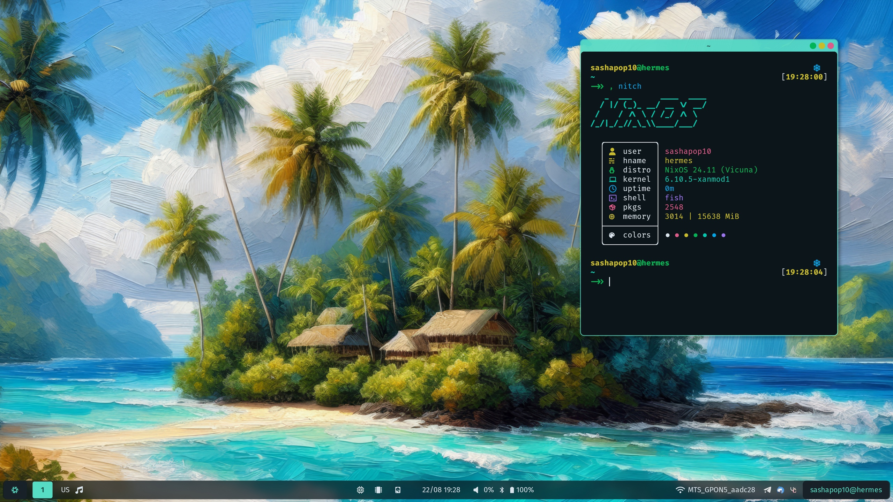

<h1 align="center">Deep dive into declarative configuration</h1>

<h5 align="center">
  <a href="https://github.com/sashapop10/nixos/issues">
    
  </a>
  <a href="https://github.com/sashapop10/nixos/stargazers">
    
  </a>
  <a href="https://github.com/sashapop10/nixos">
    
  </a>
  <a href="https://github.com/sashapop10/nixos/blob/main/.github/LICENCE">
    
  </a>
</h5>

<h5 align="center">

<details open="true">
  <summary><b>👉 Atlas</b> <i>"</i>State of 2024-08-09<i>"</i> 👈</summary><br/>


</details>

<details >
  <summary><b>👉 Hermes</b> <i>"</i>State of 2024-08-22<i>"</i> 👈</summary><br/>



</details>

</h5>

## Installation

> [!CAUTION]
>
> Applying custom configurations, especially those related to your operating system, can have unexpected consequences and may interfere with your system's normal behavior. While I have tested these configurations on my own setup, there is no guarantee that they will work flawlessly for you. I am not responsible for any issues that may arise from using this configuration.

```bash
# Working with Live CD
nix-shell -p curl git
curl https://raw.githubusercontent.com/sashapop10/nixos/main/core/hosts/<hostname>/disko.nix > /mnt/config/disko.nix
# Edit disko.nix (Replace device with name from lsblk result at least)
sudo nix --experimental-features "nix-command flakes" run github:nix-community/disko -- --mode disko /mnt/config/disko.nix
git clone https://github.com/sashapop10/nixos /mnt/flake
sudo nixos-generate-config --dir /mnt/config
mv -f /mnt/config/hardware-configuration.nix /mnt/flake/core/hosts/<hostname>
sudo nixos-install --flake /mnt/flake#<hostname>
# reboot 🚀
```

## Update

```bash
nix-channel --update
nix flake update
sudo nixos-rebuild --upgrade switch --flake .#<hostname>
```

## Rebuild

```bash
git add . # Important if new files were created
sudo nixos-rebuild switch --flake .#<hostname> # If Hosts updated
home-manager switch --flake .#<username>@<hostname> # If ONLY Home updated
```

## Structure

- `.vscode` Makes vscode more performant in this directory.
- `flake.nix` Entrypoint for hosts and home configurations.
- `shell.nix` Exposes a dev shell for bootstrapping.
- `home` Home-manager configuration
- `core` NixOS Configuration
- `hosts` Hardware specific configurations
  - `atlas` Desktop PC - 32GB RAM, i9-9900k, RTX 2080S & UHD630 | Hyprland
  - `hermes` Laptop - 16GB RAM, i7-1165G7, Iris XE G7 | Hyprland
  - `iso` Minimal ISO image configuration for bootable USB
- `library`
  - `overlays` Patches and custom overrides for some packages.
  - `modules` Modules for more accurate customization.
  - `pkgs` Self hosted packages.

## Highlights

- Multiple **NixOS configurations**
- Almost fully **Declarative** / **Self-hosted** stuff
- Flexible **Home Manager** Configs through **feature flags**
- Extensively configured wayland environment (**hyprland**) and editors (**nixvim** and **vscode**)
- **Declarative** **themes** and **wallpapers** with **nix-colors**
- **DNS** Encryption and **DPI** fooling
- Host-specific **environment variables**
- Standalone **Home Manager**
- Hosts **state syncing**

<hr/>

<p align="center">
Copyright © 2023-2024 <a href="https://github.com/sashapop10">sashapop10</a>.<br/>
This package is <a href="./LICENSE">MIT licensed</a>.<br/>
</p>

<h5 align="center">

</h5>
